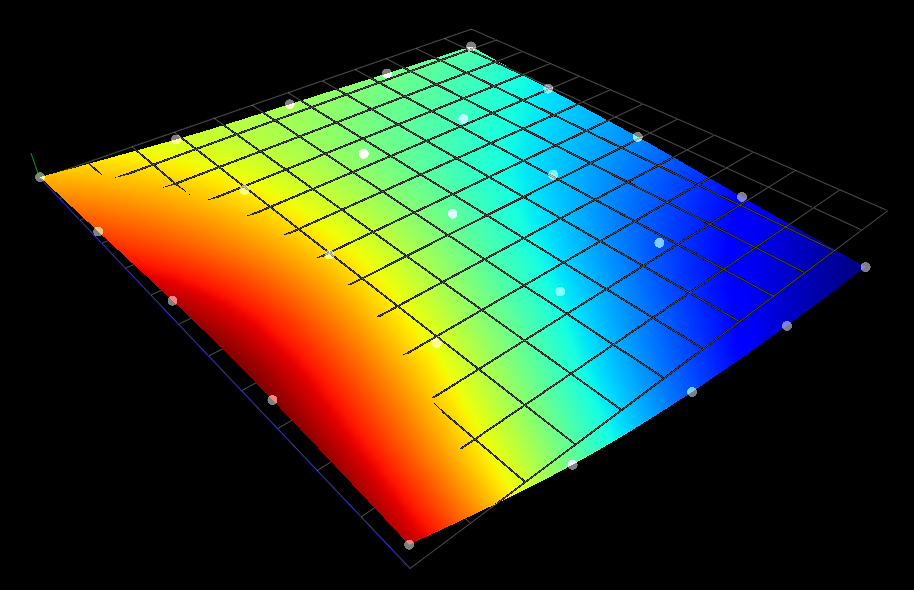

## NAME 

compensation.py 

## SYNOPSIS 

**loadusr -Wn compensation** python compensation.py probe-results.txt *cubic*

## DESCRIPTION 

**compensation.py** is a bed levelling / distortion correction user space compensation component for 3D Printing or engraving.

The component has python 2.7 dependencies of numpy, scipy and enum34.

The component utilises the external offsets feature of LinuxCNC. A probe data input file is specified in the *loadusr* string. An optional argument for the interpolation method can be either *nearest*, *linear* or *cubic*. If not specified the default method is cubic *(bicubic)* interpolation.

The probe data file must have data on a regularly spaced grid. The file can be modified / updated at anytime while compensation is disabled (Don't probe whilst compensation is enabled). When compensation is next enabled, the compensation map will be recalculated.

The component uses the Scipy **griddata** function to interpolate between the probe data points at 1mm resolution in X and Y. Moves outside of the probe data receive the compensation value at the edge of the compensation map so as not to have a jump / discontinuity.

## NAMING

The names for pins, parameters, and functions are prefixed as:  
**compensation.** name

## FUNCTIONS 

There are no discrete functions to call. Once loaded the compent runs in user space in parallel with LinuxCNC

## PINS 

| Pin | Type | Direction | Funtion|
| :--- | :--- | :---: | :--- |
| compensation.enable-in | bit | in | enables Z compensation |
| compensation.enable-out | bit | out | enables external offset |
| compensation.scale | float | out | scale value for external offset |
| compensation.count | s32 | out | count value for external offset |
| compensation.clear | bit | out | clear external offset |
| compensation.x-pos | float | in | X position command |
| compensation.y-pos | float | in | Y position command |
| compensation.z-pos | float | in | Z position command |
| compensation.fade-height  | float | in | compensation will be faded out up to this value |

eoffset == scale * count

## CONFIGURATION

For the component to function, external offsets must be enabled for the Z axis and the component linked to the eoffsets pins.

Place the compensation.py in your configuration ini directory and then add the following to your ini and hal files.

In your ini file add an OFFSET_AV_RATIO parameter

	[AXIS_Z]  
	OFFSET_AV_RATIO = 0.2

In your hal file 

	loadusr -Wn compensation python compensation.py probe-results.txt cubic

	net xpos-cmd 		<= axis.x.pos-cmd				=> compensation.x-pos
	net ypos-cmd 		<= axis.y.pos-cmd				=> compensation.y-pos
	net zpos-cmd 		<= halui.axis.z.pos-relative	=> compensation.z-pos
	net eoffset-enable	<= compensation.enable-out		=> axis.z.eoffset-enable
	net eoffset-scale	<= compensation.scale			=> axis.z.eoffset-scale
	net eoffset-counts	<= compensation.counts 			=> axis.z.eoffset-counts
	net eoffset-clear	<= compensation.clear 			=> axis.z.eoffset-clear
	net compensation-on	<= compensation.enable-in
